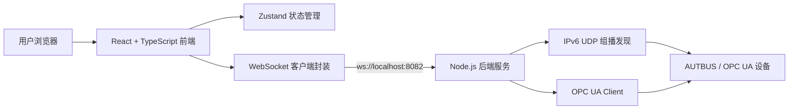

# AUTBUS Scanner 概要设计文档

## 1. 项目概述

AUTBUS Scanner 是用于 AUTBUS 设备发现、设备树查看、OPC UA 模型浏览、节点读写和对象直接操作的本地 Web 工具。系统部署在 Windows 主机上，通过本地 Node.js 后端访问网络、UDP 组播和 OPC UA 服务，前端以浏览器页面提供交互界面。

核心目标：

- 发现 AUTBUS 控制器、网关、从站等设备。
- 展示 AUTBUS 设备层级和 OPC UA 对象模型。
- 支持节点当前值查询、可读写节点修改和只读节点保护。
- 支持通过 IPv6 地址直接操作指定对象。
- 支持打包成 Windows 离线安装包。

## 2. 总体架构

系统采用前后端本地分离架构：



运行时端口：

| 模块 | 地址或端口 | 说明 |
| --- | --- | --- |
| HTTP 静态服务 | `http://localhost:3001` | 托管前端生产产物 |
| WebSocket 服务 | `ws://localhost:8082` | 前后端命令通道 |
| UDP 服务 | `6060` | AUTBUS 设备发现 |
| IPv6 组播 | `ff03::c` | 默认扫描目标地址 |

## 3. 前端设计

前端位于 `src`，技术栈为 React、TypeScript、Vite、Ant Design 和 Zustand。

主要模块：

| 模块 | 职责 |
| --- | --- |
| `App.tsx` | 页面整体布局，切换设备管理和对象直接操作视图 |
| `ScanButton.tsx` | 触发设备扫描流程 |
| `DeviceTree.tsx` | 展示 AUTBUS 设备层级，支持设备选择和连接操作 |
| `DeviceDetails.tsx` | 展示设备基础信息、属性点表和 OPC UA 总线设备树 |
| `OPCUANodeTree.tsx` | 展示 OPC UA 节点树，支持刷新节点、刷新模型、读写权限控制 |
| `ObjectDirectOperation.tsx` | 通过 IPv6 地址直接查询或修改对象 |
| `deviceStore.ts` | 设备列表、选中设备、OPC UA 连接和节点模型状态管理 |
| `networkService.ts` | 网络接口查询和设备扫描 WebSocket 封装 |
| `opcuaService.ts` | OPC UA 连接、浏览、读、写 WebSocket 封装 |

前端状态主要包括：

- 设备列表 `devices`
- 当前选中设备 `selectedDevice`
- 网络接口与扫描配置
- OPC UA 连接列表 `opcuaConnections`
- OPC UA 节点树和节点最新值
- 可读写节点的修改草稿值

## 4. 后端设计

后端入口为 `backend/server.js`，运行在本地 Node.js 环境中。

后端职责：

- 托管前端 `dist` 静态资源。
- 提供 WebSocket 命令入口。
- 枚举本机网络接口。
- 发送和接收 IPv6 UDP 组播扫描报文。
- 管理 OPC UA 客户端连接和会话。
- 浏览 OPC UA 节点模型，并读取节点值、数据类型、访问级别。
- 执行节点写入，并在写入后回读最新值。
- 为对象直接操作连接设置空闲释放策略。

后端关键内存结构：

| 结构 | 说明 |
| --- | --- |
| `opcuaConnections` | `deviceId -> OPC UA connection/session` |
| `opcuaModels` | `deviceId -> OPC UA node tree` |
| `pendingOpcuaRequests` | 可取消的 OPC UA 请求记录 |

## 5. WebSocket 接口设计

前端通过 WebSocket JSON 消息调用后端。主要消息如下：

| 请求类型 | 方向 | 功能 |
| --- | --- | --- |
| `get-network-interfaces` | 前端 -> 后端 | 查询本机网络接口 |
| `network-interfaces` | 后端 -> 前端 | 返回网络接口列表 |
| `scan` | 前端 -> 后端 | 发起 AUTBUS 设备扫描 |
| `scan-complete` | 后端 -> 前端 | 返回扫描结果 |
| `opcua-connect` | 前端 -> 后端 | 建立 OPC UA 连接，可选择跳过浏览 |
| `opcua-browse` | 前端 -> 后端 | 浏览 OPC UA 模型 |
| `opcua-read` | 前端 -> 后端 | 读取节点值、显示名、数据类型、访问级别 |
| `opcua-write` | 前端 -> 后端 | 写入节点值，并回读最新值 |
| `opcua-disconnect` | 前端 -> 后端 | 断开 OPC UA 连接 |
| `opcua-cancel` | 前端 -> 后端 | 取消超时或不再需要的 OPC UA 请求 |

读节点响应包含：

```ts
{
  status: 'success',
  deviceId: string,
  nodeId: string,
  value: unknown,
  displayName?: string,
  dataType?: string,
  accessLevel?: 'Read' | 'Write' | 'ReadWrite' | 'None'
}
```

写节点响应同样返回回读后的 `value`、`displayName`、`dataType` 和 `accessLevel`，前端以回读结果作为最终显示值。

## 6. 核心业务流程

### 6.1 设备发现

1. 前端加载网络接口。
2. 用户选择网卡并点击扫描。
3. 前端发送 `scan` 消息。
4. 后端通过 IPv6 UDP 组播发送扫描报文。
5. 后端解析设备响应，构建设备层级数据。
6. 前端更新设备树。

### 6.2 OPC UA 连接与模型浏览

1. 用户对控制器发起连接。
2. 前端发送 `opcua-connect`。
3. 后端创建 OPC UA Client 和 Session。
4. 后端浏览 Objects 节点，读取变量值、数据类型和访问级别。
5. 前端保存连接状态和节点树。
6. 用户可刷新单节点或刷新完整模型。

### 6.3 节点读写控制

1. 前端选中 OPC UA 节点。
2. “当前值”展示后端返回或轮询更新的最新值。
3. 仅当节点为变量且 `accessLevel` 为可读写时，显示“修改值”输入框。
4. 用户点击“确认修改”后，前端发送 `opcua-write`。
5. 后端根据当前节点类型构造 Variant 写入。
6. 写入后后端回读节点，前端用回读值更新当前值和修改值。
7. 只读、只写、无权限或未知权限节点不显示修改入口。

### 6.4 对象直接操作

1. 用户输入对象 IPv6 地址。
2. 前端格式化 IPv6，并生成稳定的 direct 连接标识。
3. 前端连接 `opc.tcp://[IPv6]:4840`。
4. 前端构造 `ns=1;g=<uuid>` 形式 NodeId 并读取节点。
5. 根据 `accessLevel` 决定是否展示修改入口。
6. 后端对 direct 连接执行空闲超时释放。

## 7. 数据模型

核心类型位于 `src/types/device.ts`。

| 类型 | 说明 |
| --- | --- |
| `NetworkInterface` | 本机网卡、IPv4/IPv6、MAC、scopeId 和组播接口 |
| `AUTBUSDevice` | AUTBUS 控制器、网关、从站等设备节点 |
| `OPCUAConnection` | 前端保存的 OPC UA 连接状态与节点树 |
| `OPCUANode` | OPC UA 节点，包含 NodeId、名称、节点类型、值、数据类型和访问级别 |
| `DeviceProperty` | 设备属性点表 |
| `DiscoveryConfig` | 组播地址、端口等扫描配置 |

## 8. 权限与安全设计

- 前端仅对可读写变量节点展示修改入口。
- 后端读取 OPC UA `AccessLevel` 并标准化为 `Read`、`Write`、`ReadWrite` 或 `None`。
- 写入后必须回读，以服务器最终值作为前端显示依据。
- 只读和未知权限节点不允许在界面发起写入。
- WebSocket 只监听本地服务地址，适用于单机工具场景。
- HTTP 静态服务限制路径必须位于 `dist` 目录内，避免目录穿越。

## 9. 打包部署设计

打包脚本位于 `scripts/package-win.ps1`。

部署形态：

- `dist`：前端生产产物。
- `backend`：后端入口和依赖。
- `runtime\node.exe`：随包运行时。
- `install.cmd` / `install.ps1`：安装入口。
- `start.cmd`：启动入口。
- zip：最终交付物。

目标机器安装目录：

```text
%LOCALAPPDATA%\AUTBUS Scanner
```

## 10. 异常处理与约束

主要异常场景：

- WebSocket 连接失败：前端提示失败或返回空扫描结果。
- OPC UA 连接超时：前端请求取消，后端释放相关连接。
- 浏览节点超时：前端提示浏览失败。
- 写入失败：后端记录错误并尽量回读最新值。
- 端口占用：需要释放 `3001`、`8082`、`6060`。
- 防火墙拦截：会影响 UDP 发现和 OPC UA 访问。

当前约束：

- 运行环境为 Windows 本地桌面使用场景。
- 默认端口固定，修改端口需要改后端配置并重新打包。
- 设备发现依赖 IPv6 网络和正确网卡选择。
- 后端状态存储在内存中，服务重启后连接和模型缓存清空。

## 11. 后续扩展建议

- 将端口、组播地址、超时时间改为外部配置。
- 增加操作日志导出和错误日志文件。
- 增加 OPC UA 节点订阅，减少轮询开销。
- 增加安装包签名和版本升级机制。
- 增加自动化端到端测试，覆盖扫描、连接、读写和直接操作流程。

